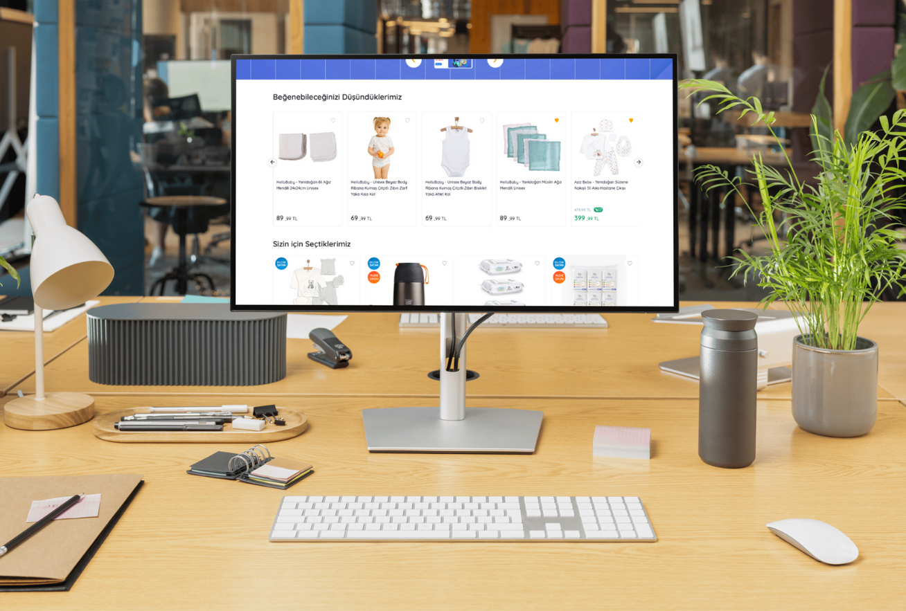
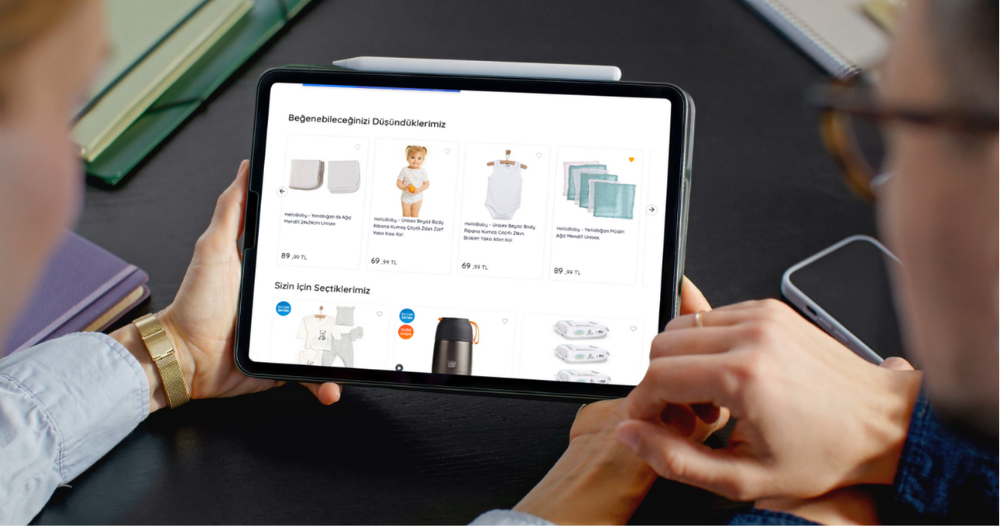
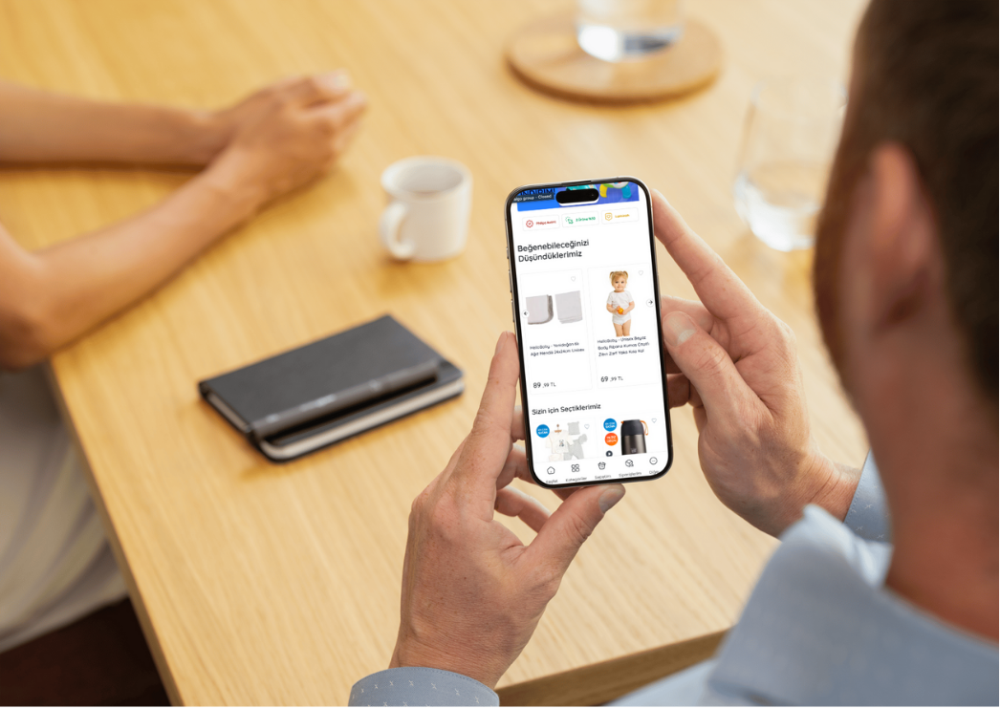

### Todos
---
- [x] 1: Fetch the product list from this link sending a GET request.
- [x] 2: Title of the carousel should be "Beğenebileceğinizi düşündüklerimiz".
- [x] 3: You code should only run in homepage, if user is on any other page you need to console.log "wrong page". 

- [x] 4: When a user clicks on a product, the respective product page should open in a new tab.

- [x] 5: If “price” and “original_price” are different, show both price like in the example and also calculate the discount amount and show it as well. 

- [x] 6: When user clicks on the heart icon should fill it with orange color, and this preference should be stored in the local storage in an array.

- [x] 7: When the code runs for the second time: 
  > - [X] It should retrieve the product list from local storage rather than sending a new fetch request. 
  > - [x] Products marked as favorites before are displayed with filled heart icons. 
  
- [x] 8: The design must be responsive and suitable for all platforms exactly like the website version.
---

### Demo: [Youtube Link](https://youtu.be/X3eECTPnIAQ)

---
#### Example of the carousel: Desktop View

#### Example of the carousel: Tablet View

#### Example of the carousel: Phone View
